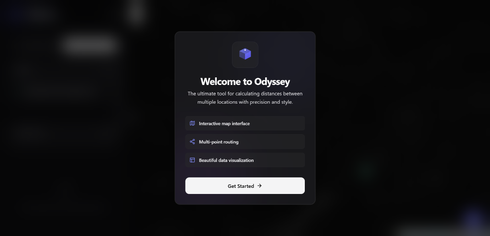
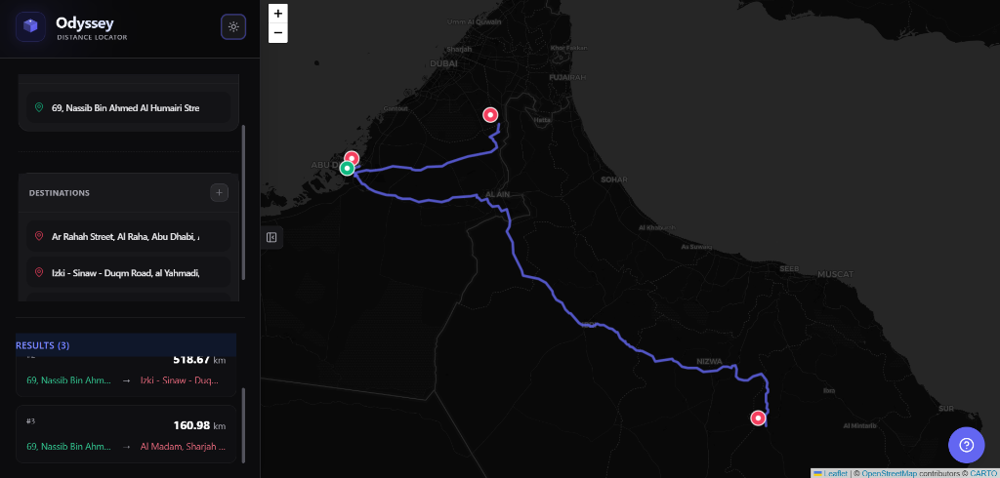
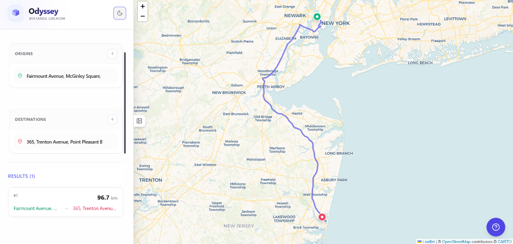

# 🌌 Odyssey - Distance Locator

> A premium, interactive web application designed to calculate distances between multiple locations with precision and style. Features a modern, "Prody"-inspired UI with a "Black Spectrum" dark mode.



## ✨ Features

### 🗺️ Interactive Global Map
*   **Smart-locked World View**: Prevents coordinate wrapping issues.
*   **Powered by Leaflet**: Smooth, responsive mapping experience.
*   **Drag-and-Drop**: Right-click to add points, drag markers to adjust.

### 🛣️ Robust Routing
*   **OSRM Integration**: Accurate road-distance calculations.
*   **Smart Normalization**: Automatically handles date-line crossing logic.
*   **Multiple Modes**:
    *   **One-to-Many**: 📍 Hub-and-spoke delivery style.
    *   **Many-to-Many**: 🕸️ Complete distance matrix.

### 🎨 Premium Aesthetic
*   **"Prody" Design System**: Clean, card-based UI with monotonic colors.
*   **Black Spectrum Dark Mode**: optimized for high contrast and visual comfort.
*   **Glassmorphism**: Subtle, modern transparency effects.
*   **Smooth Animations**: Staggered entrances and polished interactions.

### ⚡ Technical Excellence
*   **React + Vite**: Blazing fast performance.
*   **TypeScript**: Type-safe and robust.
*   **Local Persistence**: Your data is saved automatically.

## 🚀 Getting Started

1.  **Install Dependencies**
    ```bash
    npm install
    ```

2.  **Run Development Server**
    ```bash
    npm run dev
    ```

3.  **Build for Production**
    ```bash
    npm run build
    ```

## 📸 Screenshots

### Dark Mode & Dashboard


### Light Mode & Mapping


### Welcome Experience


## 📄 License

MIT © 2024
